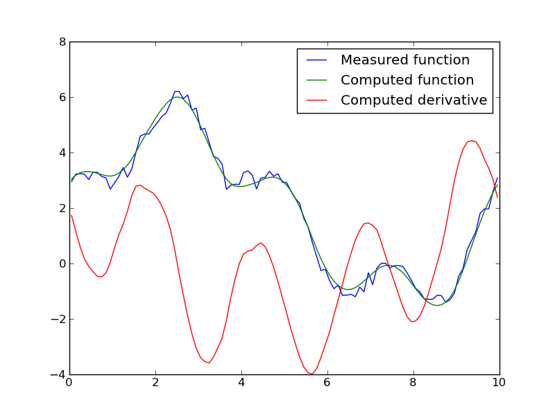

=======================================
Linear example: the derivative problem
=======================================

We want to solve the following.

.. admonition:: Inverse Problem

  Given a function  :math:`G` defined on an interval :math:`[0,L]`, 
  find its derivative.

We will use the :math:`L^2` norm for functions, so 

.. math:: ||G||_{L^2} = \left[ \int_0^L G(x)^2\; dx \right]^\frac{1}{2}

and the inner-product of :math:`F` and :math:`G` is

.. math:: \left< F, G\right> = \int_0^L F(x) G(x)\; dx.

The problem of finding a derivative is discontinuous, and therefore not well-posed.  For example, consider

.. math:: G_k(x) = \left(\frac{x}{L}\right)^k.

These functions converge in :math:`L^2` to the zero function; indeed the
norms

.. math:: ||G_k||_{L^2}^2 = \frac{L}{2k+1}

converge to zero as :math:`k\rta \infty`. But

.. math:: G_k'(x) = \frac{k}{L}\left(\frac{x}{L}\right)^{k-1}

and 

.. math:: ||G_k'||_{L^2}^2 = \frac{1}{L} \frac{k^2}{2k-1} \approx \frac{k}{2L}

for large values of :math:`k`.  That is, the derivatives blow up in :math:`L^2` even though the functions converge to zero in :math:`L^2`.

In fact, the problem of finding a derivative is the ill-posed inverse
problem to a well-posed forward problem.

.. _forward:
.. admonition:: Forward Problem

  Given a a function :math:`g` defined on an interval :math:`[0,L]`, find a function :math:`G` such that

  .. math:: G' = g

  and such that
  
  .. math:: \frac{1}{L}\int_0^L G \; dx = 0.

Notice that we have to include an extra condition on :math:`G` since 
antiderivatives are only defined up to a constant.  We could have used 
some other condition, such as :math:`G(0)=0`, which might feel more familiar.  But this puts a lot of importance on the specific value at :math:`x=0`.

Let :math:`T(g)` be the solution :math:`G` of the :ref:`forward problem <forward>`.  The inverse problem can then be formulated as: given :math:`G\in L^2`, find :math:`g\in L^2` such that

.. math:: T(g) = G.
  :label: inverse-deriv

There is this pesky detail about constants, however.  Since the output
of :math:`T` is always a zero-mean function, we can only solve
equation :eq:`inverse-deriv` if the right-hand side is a zero-mean function.
This isn't a major problem, since we can convert any function :math:`G` into a zero mean function by subtracting off a constant, and doing so won't affect the derivative :math:`G'` that we are trying to find.

In order to apply a gradient method to solving equation :eq:`inverse-deriv` we
need to be able to compute the adjoint of :math:`T`.  In fact,
its adjoint is :math:`-T`.  To see this, suppose :math:`g` and :math:`f` belong to :math:`L^2` and have zero mean, and let :math:`G=T(g)` and :math:`F=T(f)`.  Since :math:`g` has zero-mean,

.. math:: G(L)-G(0) = \int_0^L G'(x)\; dx = \int_0^L g(x)\; dx = 0.

So :math:`G(L)=G(0)`.  Similarly, :math:`F(L)=F(0)`.  Now

.. math::
  \left<T(g),f\right> &= \int_0^L T(g) f \; dx \\
  & = \int_0^L G F'\; dx

since :math:`F'(x)=f(x)`. Integrating by parts we have

.. math::
  \int_0^L G F'\; dx &= G(L)F(L)-G(0)F(0) - \int_0^L G'\; F\;dx \\
 &= -\int_0^L g\; F\; dx

since :math:`G(L)=G(0)` and :math:`F(L)=F(0)`.  In summary,

.. math::
  \left<T(g),f\right> = \int_0^L g\; (-F)\; dx = \left<g,-T(f)\right>.

The adjoint of :math:`T` always satisfies

.. math::
  \left<T(g),f\right> = \left<g,T^*(f)\right>.

Comparing these last two equations lets us conclude that :math:`T^*=-T`.

The forward problem class
^^^^^^^^^^^^^^^^^^^^^^^^^

The inverse problem we are solving is linear, since :math:`T` is a linear
function.  In order to use a gradient-based method for 
solving the inverse problem,
we specify the forward problem with a :class:`LinearFowardProblem <siple.gradient.forward.LinearForwardProblem>`.
This class describes the forward problem, its adjoint, and the inner-products
for the domain and range.

We discritize the problem by subdividing the interval :math:`[0,L]` into :math:`N` subintervals of equal length :math:`h=L/N`::

  from siple.gradient.forward import LinearForwardProblem
  from siple.linalg.linalg_numpy import NumpyVector

  class AntiderivativeForwardProblem(LinearForwardProblem):

    def __init__(self,L,N):
      """Forward problem with an interval of length *L* and *N* subintervals."""
      self.h = float(L)/N
      self.N = N
      self.L = L

      self.scratch = numpy.ndarray((self.N+1,))

The :data:`scratch` variable is allocated here for use later
in computing the discrete forward problem.

Functions in :math:`L^2` will be approximated by functions that 
are piecewise constant on each subinterval, and we
will represent such functions using :class:`numpy.ndarray`\s.
Computation of the inner products is straightforward::

    def domainIP(self,x,y):
      return self.h*numpy.dot(x.core(),y.core())

    def rangeIP(self,x,y):
      return self.h*numpy.dot(x.core(),y.core())

The |siple| internals wrap vectors with :class:`AbstractVector <siple.linalg.linalg_abstract.AbstractVector>` objects so that the same algorithms can be applied to vectors without knowing the details of the underlying implementation.  In this case, the :class:`numpy.ndarray` vectors will be wrapped by the :class:`NumpyVector <siple.linalg.linalg_numpy.NumpyVector>` subclass of :class:`AbstractVector <siple.linalg.linalg_abstract.AbstractVector>`. The 
variables :data:`x` and :data:`y` passed to :func:`domainIP` are
:class:`NumpyVector <siple.linalg.linalg_numpy.NumpyVector>`\s, and the underlying
:class:`numpy.ndarray`\s are accessed with the :func:`core` method.

To compute the discrete forward problem, we need to find the antiderivative
of a piecewise-constant functions.  These are continuous piecewise-linear functions, which we represent by a vector of values at the subinterval endpoints.  Note that there is one more endpoint than there are subintervals.
We then project the piecewise-linear function back into the subspace
of piecewise-constant functions, and convert the function into a
zero-mean function by subtracting off its mean::

  def T(self,x,out=None):
    """Computes the antiderivative of *x* with mean zero."""
    x = x.core()
    scratch = self.scratch

    if out is None:
      out = NumpyVector(x.shape)

    # Compute a piecewise linear anti-derivative
    scratch[0] = 0
    for k in range(self.N):
      scratch[k+1] = scratch[k] + self.h*x[k]
    
    # Project it back into the subspace of piecewise-constant functions
    y=out.core()
    for k in range(self.N):
      y[k] = 0.5*(scratch[k] + scratch[k+1])
    
    # Make it a zero-mean function
    ybar = sum(y)/self.N
    y -= ybar
    
    # Return the result
    return out

Many methods in |siple| use the convention that storage for the output may have been previously allocated and is passed in with the keyword argument :data:`out`.  If it hasn't already been allocated (i.e. if :data:`out is None`), it needs to be allocated by the the method.  Regardless of whether
the storage was previously allocated or not, it needs to be returned as the function value.

Since :math:`T^*=-T`, we can can reuse the code we've already written to
specify the adjoint::

  def TStar(self,r,out=None):
    """Computes the adjoint of :math:`T`, in this case :math:`-T`."""
    out = self.T(r,out=out)
    out.scale(-1)
    return out

A point of caution is needed here. Although :math:`T^*=-T` for the forward problem, there is no guarantee that this equation holds for an arbitrary discrete version. In fact, one can show that this does hold for our discrete problem.  We can test that we've
coded the adjoint correctly by comparing the inner products

.. math::  \left<T(d),r\right> \quad\text{and}\quad \left<d,T^*r\right>

for various inputs :math:`d` and :math:`r`.
The :class:`LinearFowardProblem <siple.gradient.forward.LinearForwardProblem>`
class has a :func:`testTStar` method that is used to compute these
two inner-products for testing and debugging.  Keeping in mind that
our computation of the adjoint only applies to *zero-mean* functions,
the following snippet tests the adjoint::

  from siple.rand import random_vector
  
  # Make a forward problem.
  L=10
  N = 100
  fp = AntiderivativeForwardProblem(L,N)
  
  # Construct some random vectors in the domain and range spaces with
  # coefficients near 1.
  y = NumpyVector((N,))
  d = RandomVector(y,scale=1)
  d.core()[:] -= sum(d.core())/N # zero-mean!
  r = RandomVector(y,scale=1)
  r.core()[:] -= sum(r.core())/N # zero-mean!

  # Compute the two inner-products
  print fp.testTStar(d,r)
  
Running this script results in the output::

  (0.35278547859573611, 0.35278547859573595)

so we are pretty confident we've coded the adjoint correctly.

The regularization algorithm
^^^^^^^^^^^^^^^^^^^^^^^^^^^^

With the forward problem all specified, we can now feed it to 
an algorithm for regularizing the inverse problem.  We'll use the 
conjugate gradient method applied to the normal equation

.. math:: T^* T G =  T^* g

using the Morozov discrepancy principle stopping criterion.
The solver class is a :class:`BasicKrylovCGNE <siple.gradient.linear.BasicKrylovCGNE>` which is exactly designed
for this purpose. Using one is a two-step process: build it from a forward problem, and then solve::

  from siple.gradient.linear import BasicKrylovCGNE
  forward_problem = AntiderivativeForwardProblem(L,N)
  solver = BasicKrylovCGNE(forward_problem)
  (xc,yc) = solver.solve(x0,y,discrepancy)

This finds an approximate solution :data:`xc` to the equation

.. math:: T x = y

and for convenience returns the approximate right-hand side :data:`yc`.

The right-hand side :data:`y` is an argument to :func:`solve`, as is an 
initial estimate :data:`x0` for the solution.  The remaining argument :data:`discrepancy` specifies the amount of error in the right-hand side :data:`y`.  A solution is found only to within this level of error, which then
regularizes the problem.

The vector inputs to :func:`BasicKrylovCGNE.solve` are
:class:`AbstractVector <siple.linalg.linalg_abstract.AbstractVector>`\s.
Moreover, for our particular inverse problem we have this ongoing 
nuisance of working with zero-mean functions.  We can make working
with the solver a little easier by subclassing it and overriding the :func:`solve` method to take care of these details::

  class Solver(BasicKrylovCGNE):
    def solve(self,x,y,targetDisc):
      y = y.copy()
      ybar = sum(y)/len(y)
      y -= ybar
    
      x = x.copy()
      xbar = sum(x)/len(x)
      x -= xbar

      (xc,yc) = BasicKrylovCGNE.solve(self,NumpyVector(x),NumpyVector(y),targetDisc)

      xc.core()[:] += xbar
      yc.core()[:] += ybar
    
      return (xc.core(),yc.core())

Here we have made zero-mean copies of the input vectors (which are :class:`numpy.ndarray`\s) and converted them into 
:class:`NumpyVector <siple.linalg.linalg_numpy.NumpyVector>`\s
On exit, we add the means back in and extract the 
:class:`numpy.ndarray`\s.

The classes described here for solving the derivative problem can be found
in the script :file:`examples/derivative.py`, which also contains code
for performing a sample inversion.

From the shell, use::
  
  python derivative.py --help

to see options for running the script.  For example, ::

  python derivative.py -L 10 -N 40 -n 0.2

performs an inversion on an interval of length 10 with 40 subintervals
and random errors with standard deviation 0.2 added to the input to the
inverse problem, and results in the following graph

The blue curve is the input function :math:`G` and we are trying to 
solve

.. math:: 
  T g = G.
  
The red curve is the approximate solution :math:`g` and the green curve
is its antiderivative :math:`T g`, which is an approximation of :math:`G`.

  

