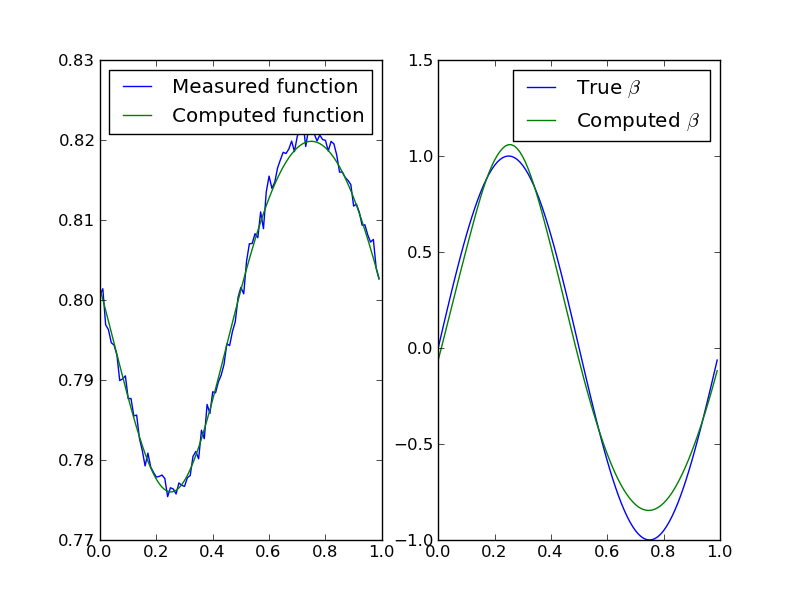

=============================================
Nonlinear example: coefficient identification
=============================================

Consider the following differential equation on the
interval :math:`[0,1]` with periodic boundary conditions.

.. math:: 
  :label: sturm

  -u''+ e^\beta u &= 1 \\
  u(0) &= u(1) \\
  u'(0) &= u'(1).

.. admonition:: Inverse Problem

  Given a function  :math:`u` defined on an interval :math:`[0,1]`, 
  determine the coefficient :math:`\beta`.
  
The corresponding forward problem is

.. _forward:
.. admonition:: Forward Problem

  Given a coefficient :math:`\beta`, find :math:`u` solving equation :eq:`sturm`.
  
Following our standard notation for forward problems, we'll write :math:`u=\calF(\beta),`  and we'll use the :math:`L^2` norm for functions
defined on :math:`[0,1]`.

To apply a gradient method to solve the inverse problem, we need to compute
the :ref:`linearization <derivatives>` :math:`\calF'_\beta` of :math:`\calF` and its :ref:`adjoint <adjoints>` :math:`(\calF'_\beta)^*`.  Recall

.. math:: \calF'_\beta(h) = \left. \frac{d}{dt}\right|_{t=0} \calF(\beta+th).

Letting :math:`u_t=\calF(\beta+th)` we see that :math:`u_t` is periodic and

.. math:: -u_t''+ e^{\beta+th} u_t &= 1.

Taking the derivative of this equation with respect to :math:`t` and setting
:math:`t=0` we have 

.. math:: -w''+ e^{\beta} w + e^{\beta} h u &= 0.

where :math:`u=u_0` and :math:`w= d/dt|_{t=0} u_t`.  Hence
:math:`\calF'_\beta(h)` is :math:`w` solving

.. math:: 
  :label: sturmp

  -w''+ e^\beta w &= -e^{\beta} u h \\
  w(0) &= w(1) \\
  w'(0) &= w'(1).

To compute the adjoint of :math:`\calF'_\beta`, it's useful
to factor :math:`\calF'_\beta = G \circ H` where
:math:`H(h)=-e^{\beta} u h` and :math:`G(f)` is the function :math:`w`
solving

.. math:: 
  :label: Gdef
  
  -w''+ e^\beta w &= f \\
  w(0) &= w(1) \\
  w'(0) &= w'(1).

Now :math:`(\calF'_\beta)^*=(G\circ H)^*=H^*\circ G^*`, so
we need to determine the adjoints of :math:`G` and :math:`H`.
In fact, :math:`H^*=H`
since for any functions :math:`k` and :math:`h` in :math:`L^2([0,1])`,

.. math:: 

  \ip<H(h),k> = \int_0^1 H(h) k \;dx = \int_0^1 -e^{\beta}u h k \;dx
  = \int_0^1 h(-e^{\beta}u k) \;dx = \int_0^1 h H(k) \;dx = \ip<h,H(k)>.

On the other hand, :math:`G^*=G` also.  To see this, let :math:`f,g\in L^2([0,1])` and let :math:`w=G(f)` and :math:`v=G(g)`.  Then

.. math:: 
  :label: Gadj1

  \int_0^1 v'w' + e^{\beta} wv \; dx = \int_0^1 f v\; dx

since :math:`w` solves equation :eq:`Gdef` and is periodic.  But

.. math:: 
  :label: Gadj2

  \int_0^1 v'w' + e^{\beta} wv \; dx = \int_0^1 w g\; dx

since :math:`v` solves equation :eq:`Gdef` with right-hand side :math:`g`.
From equations :eq:`Gadj1` and :eq:`Gadj2` it follows that

.. math:: \ip<G(f),g> = \int_0^1 w g\; dx = \int_0^1 f v\; dx = \ip<f,G(g)>.

Hence :math:`G^*=G`.  We conclude that 

.. math:: (\calF_\beta')(g) = H^*(G^*(g)) = -e^{\beta u} v

where :math:`v` is periodic and solves

.. math:: -v'' + e^{\beta} v = g.

The forward problem class
^^^^^^^^^^^^^^^^^^^^^^^^^

The forward problem :math:`\calF` taking :math:`\beta` to :math:`u`
via equation :eq:`sturm` is nonlinear (even thought the differential
equation itself is linear).  Hence we use a :class:`NonlinearFowardProblem <siple.gradient.forward.NonlinearForwardProblem>` to encode the 
forward problem.  We'll use the finite element method to discretize 
the differential equation using piecewise linear basis functions
on :math:`N` subintervals of :math:`[0,1]` of equal length :math:`h`.
To ensure that this example doesn't depend on any specialized packages,
we'll use :data:`numpy` vectors and :data:`scipy` sparse matrices,
assembling the relevant finite element matrices by hand.

The forward problem needs to implement 

1. Inner products on the domain :math:`X` and range :math:`Y` (which are both :math:`L^2([0,1])`).
2. The forward map :math:`\calF`.
3. The linearization of :math:`\calF` at :math:`\beta`, i.e. :math:`\calF_\beta'`.
4. The adjoint of this linearization, i.e. :math:`(\calF_\beta')^*`.

The inner products are defined as follows::

  import siple
  from siple.gradient.forward import NonlinearForwardProblem
  from siple.linalg.linalg_numpy import NumpyVector
  import numpy as np
  from scipy import sparse
  from scipy.sparse.linalg import spsolve
  from math import sqrt, exp, pi

  class CoeffForwardProblem(NonlinearForwardProblem):
    """Implements the forward problem of finding a perioodic function :math:`u` 
    on :math:`[0,1]` solving 
  
    .. math:: -u'' + e^{\beta} u = 1.
    """

    def rangeIP(self,x,y):
      """:math:`L^2` inner product"""
      return np.dot(x.core(),self.B*y.core())

    def domainIP(self,x,y):
      """:math:`L^2` inner product"""
      return np.dot(x.core(),self.B*y.core())

In these methods, :math:`B` is the matrix (assembled in the constructor)
with entries :math:`B_{ij} = \int_0^1\phi_i\phi_j\; dx` where the :math:`\phi_i`'s
are finite-element basis functions.  The :func:`core <siple.linalg.linag_abstract.core>` methods
extract :class:`numpy.ndarray` from their wrapping 
:class:`NumpyVector <siple.linalg.linalg_numpy.NumpyVector>`\s.

The forward problem map :math:`\calF` is implemented via::

  def F(self,beta,out=None,guess=None):

    self.assemble_low_order(beta.core())

    # scipy 'csr' matrix doesn't support +=, so be inefficient
    self.system = self.A + self.low_order
  
    u=spsolve(self.system,self.Frhs)

    if not out is None:
      out.core()[:] = u[:]
    else:
      out = NumpyVector(u)
    return out

The differential equation :eq:`sturm` involves a derivative term that does not
depend on :math:`\beta`, a low order term that does depend on :math:`\beta`, and a fixed right-hand side that is independent of :math:`\beta`.  The matrix for the derivative terms is preassembled in :data:`self.A`, as is the right-hand side in :data:`self.Frhs`.  The call to :func:`assemble_mass`
constructs the part of the system matrix corresponding to the low-order
terms that do depend on :math:`\beta`, and we save the system matrix for future use since both the linearization of :math:`\calF` and its adjoint require it.  For nonlinear problems, it is frequently useful to have an initial guess for the solution, and this can be passed to :func:`F` with the :data:`guess` keyword argument.  In this case, the underlying differential equation is linear and there is no need to make use of an initial guess, so we ignore the argument.  The :data:`out` keyword argument allows the method to make  efficient reuse of storage if possible.  This mechanism is undermined by  :func:`spsolve`, which does not allow a preallocated output variable to be specified.  Hence there is an unfortunate memory allocation (in :func:`spsolve`) and subsequent a copy to :data:`out`.

The linearization :math:`\calF_\beta'` depends on the particular value 
of :math:`\beta`, and also makes use of :math:`u=\calF(\beta)` as
seen previously in equation :eq:`sturmp`.  In typical usage, the forward map 
:math:`\calF` is called once for a given value of :math:`\beta`, and then its linearization at :math:`\beta` (or the corresponding adjoint) is called multiple times.  Setting up data for the linearization can be expensive, and frequently involves solving the forward problem (as is the case here). To 
allow for all of this to happen efficiently, we implement :func:`evalFAndLinearize <siple.gradient.forward.NonlinearForwardProblem.evalFAndLinearize>`
method::

  def evalFAndLinearize(self,beta,out=None,guess=None):
    out = self.F(beta,out=out,guess=guess)

    # Copy beta and u for use in later assembly.
    self.u[:] = out.core()[:]
    self.beta[:] = beta.core()[:]
  
    return out

The values of :math:`u` and :math:`\beta` are cached for later use.  For historical reasons, there is also a  :func:`linearizeAt <siple.gradient.forward.NonlinearForwardProblem.linearizeAt>`
method that does not return a function value. We simply foward
the call along and ignore the output. ::

  def linearizeAt(self,beta,guess=None):
    self.evalFAndLinearize(beta,guess=guess)

The linearization itself is implemented as follows::

  def T(self,h,out=None):
    h = h.core()

    if out is None:
      out = NumpyVector(h.shape)

    self.assemble_Trhs(self.beta,self.u,h)
    out.core()[:] = spsolve(self.system,self.Trhs)

    return out

Here the right-hand size of equation :eq:`sturmp` is assembled
in the call to :func:`self.assemble_Trhs`, while the :data:`system`
matrix would have previously been assembled in a call to the forward map
:func:`F`.  

The adjoint is coded via::

  def TStar(self,g,out=None):
    g = g.core()

    if out is None:
      out = NumpyVector(g.shape)

    v = spsolve(self.system,self.B*g)
    self.assemble_Trhs(self.beta,self.u,v)
    out.core()[:] = spsolve(self.B,self.Trhs)

    return out

There are two steps to coding the adjoint here.  The first step
finds :math:`v=G^*(g)`, where :math:`G^*=G` was defined earlier using
equation :eq:`Gdef`.  The second step is to compute :math:`H(v)=-e^\beta\,u\,v`.  Since this function is not typically piecewise linear, it needs to be projected back into the finite element space.
So we solve for :math:`z` in the finite-element space solving

.. math:: \int_0^1 z \phi_i \; dx = \int_0^1 -e^\beta\,u\,v \phi_i\; dx

for all basis functions :math:`\phi_i`.

The messy details of the finite-element implementation are tucked away in the forward problem's constructor and in the two methods :func:`assemble_low_order` and :func:`assemble_Trhs`. They are listed :ref:`below <fem>`, but a full understanding of them is not essential.

To test the linearization, the :class:`NonlinearFowardProblem <siple.gradient.forward.NonlinearForwardProblem>`
class has a :func:`testT <siple.gradient.forward.NonlinearForwardProblem.testT>` method that computes a finite difference approximation of the derivative and then its value as coded in :func:`T`. ::

  N=6
  fp = CoeffForwardProblem(N)

  beta=NumpyVector((N,))
  beta.core()[:] = np.sin(fp.x*2*pi)
  h = siple.rand.random_vector(beta,scale=1.)

  (Fp1,Fp2) =  fp.testT(beta,h,t=1e-6)
  dF = Fp1.copy(); dF -= Fp2
  print 'Relative T error: %g' % (dF.norm('linf')/Fp1.norm('linf'))

Here we build a coefficient :math:`\beta(x)=\sin(2\pi x)` (using a variable of :math:`x`-coordinates conveniently stored by the forward problem) and then
test the linearization at :math:`\beta` in the direction :math:`h`. The script results in

  Relative T error: 3.5158e-07

although the specific output depends on the randomly chosen direction :math:`h`.  One can imagine testing with a more systematic selection of directions, but this is a handy quick check.

The adjoint of the linearization can be tested using :func:`testTStar <siple.gradient.forward.NonlinearForwardProblem.testTStar>` which works 
in a similar fashion to the one described in the :ref:`linear example <TStar>`, computing the inner products

.. math::  \left<T(h),g\right> \quad\text{and}\quad \left<h,T^*g\right>

which should be the same. The script ::

  N=6
  fp = CoeffForwardProblem(N)

  beta=NumpyVector((N,))
  beta.core()[:] = np.sin(fp.x*2*pi)
  h = siple.rand.random_vector(beta,scale=1.)

  g = siple.rand.random_vector(beta,scale=1.)
  (ip1,ip2) = fp.testTStar(beta,h,g)
  print 'Relative T* error: %g' % (abs(ip1-ip2)/abs(ip1))

results in ::

  Relative T* error: 1.13037e-16

The regularization algorithm
^^^^^^^^^^^^^^^^^^^^^^^^^^^^

We regularize the problem by minimizing

.. math:: J(\beta) = ||u-\calF(\beta)||^2

with the nonlinear conjugate gradient algorithm, using the Morozov discrepancy principle stopping criterion. This can be done with a :class:`BasicInvertNLCG <siple.gradient.nonlinear.BasicInvertNLCG>` object. ::

  siple.gradient.nonlinear import BasicInvertNLCG
  forward_problem = CoeffForwardProblem(N)
  solver = BasicInvertNLCG(forward_problem)
  # intial guess in *beta0*, observed function in *u*
  (betac,uc) = solver.solve(beta0,u,discrepancy)

This finds an approximate solution :data:`betac` to the inverse problem
and for convenience returns the corresponding approximate solution 
:data:`uc` of the differential equation.

The observed data :data:`u` is an argument to :func:`solve`, as is an 
initial estimate :data:`beta0` for the coefficient to be determined.  The remaining argument :data:`discrepancy` specifies the amount of error in the :data:`u`.  A solution is found only to within this level of error, which then
regularizes the problem.

The classes described here for solving the coefficient problem can be found
in the script :file:`examples/e2/coeff.py`, which also contains code
for performing a sample inversion.

From the shell, use::
  
  python coeff.py --help

to see options for running the script.  For example, ::

  python coeff.py -N 100 -n 0.001

performs an inversion with 100 subintervals
and random errors with (pointwise) standard deviation 0.001 added to the input to the inverse problem, and results in the following graph

The |siple| library classes support a basic parameter mechanism for
supporting the myriad parameters that are associated with a numerical method.
Some classes offer a static :func:`defaultParameters` method that
can be used to obtain a dictionary of parameters.  These can be adjusted, and then passed as an argument to the class's constructor.  For example, ::

  siple.gradient.nonlinear import BasicInvertNLCG
  forward_problem = CoeffForwardProblem(N)
  params = BasicInvertNLCG.defaultParameters()
  params.steepest_descent = True
  params.ITER_MAX = 500
  solver = BasicInvertNLCG(forward_problem,params=params)

constructs a :class:`BasicInvertNLCG <siple.nonlinear.BasicInvertNLCG>` but instructs it that it should use the steepest descent algorithm (which is a trivial but slower modification of the conjugate gradient algorithm) and increases the allowed number of iterations to 500 before a failed inversion is declared.

.. _fem:

As promised, here is the remaining code for the forward problem that implements the finite-element method::
  
  def __init__(self,N):
    """Setup finite element forward problem with *N* subintervals."""
    L = 1.
    self.h = L/N; h = self.h
    self.N = N

    self.x = np.arange(N)*h
  
    # 5th order gaussian quadrature points and weights
    self.quadpts = np.array([-sqrt(3./5.),0,sqrt(3./5.)])
    self.quadwts = np.array([5./9,8./9,5./9])

    # Data for finite-element basis functions
    l = (1.+self.quadpts.copy())/2.
    r = (1.-self.quadpts.copy())/2.
    self.b = [ l, r] # values of basis functions at quad points
    self.bprime = [-1./self.h, 1./self.h] # derivatives of basis functions

    # Matrix for \int \phi_i' \phi_j'
    A = sparse.lil_matrix((N,N))
    eps = 1./h
    for k in range(N):
      A[k, (k-1) % N] = -eps
      A[k, (k+1) % N] = -eps
      A[k, k] = 2*eps
    self.A = A.tocsr()

    # Matrix for \int \phi_i \phi_j
    B  = sparse.lil_matrix((N,N))
    for k in range(N):
      B[k,k] = 2*h/3.
      B[k,(k+1) % N] = h/6.
      B[k,(k-1) % N] = h/6.
    self.B = B.tocsr()

    #  Variable that will eventually hold the system matrix.
    self.system = None

    #  Variable that will eventually hold the low-order terms matrix
    self.low_order = None

    # Right-hand side for main PDE is always 1
    self.Frhs = self.B*np.ones((N,))

    # Storage for linearized operator right-hand side.
    self.Trhs = np.zeros((N,))

    # Storage for current value of beta, u when working with linearizations
    self.u = np.zeros((N,))
    self.beta = np.zeros((N,))

  def assemble_low_order(self,beta):
    """Assemble the matrix :math:`M[i,j]=\int e^\beta \phi_i \phi_j."""
  
    N = self.N
    self.low_order = sparse.lil_matrix((N,N))
    low_order = self.low_order
    quadpts = self.quadpts
    b = self.b; bprime = self.bprime
    l = b[0]; r=b[1]

    low_order *= 0.
    for k in xrange(N):
      for p in xrange(len(quadpts)):
        betap = beta[k]*l[p] + beta[(k+1) % N]*r[p] # value at quad pt.
        Jxw = self.quadwts[p]*self.h/2. # extra /2 since quad formulas are on [-1,1]
        for i in xrange(2):
          for j in xrange(2):
            I = (i+k) % N;  J = (j+k) % N; 
            low_order[I,J] += Jxw * exp(betap) * b[i][p] * b[j][p]

    # On the first go-round, we haven't yet converted to CSR format, so
    # do this now.
    if low_order.getformat() != 'csr':
      self.low_order = low_order.tocsr()

  def assemble_Trhs(self,beta,u,h):
    """Compute :math:`rhs[j] = \int e^\beta u \phi[j]` """
    N = self.N
    quadpts = self.quadpts
    b = self.b;
    l = b[0]; r=b[1]

    rhs = self.Trhs
    rhs[:] = 0
  
    for k in xrange(N):
      for p in xrange(len(quadpts)):
        Jxw = self.quadwts[p]*self.h/2
        kk = (k+1) % N
        betap = beta[k]*l[p] + beta[kk]*r[p] # value at quad pt.
        up = u[k]*l[p] + u[kk]*r[p] # value at quad pt.
        hp = h[k]*l[p] + h[kk]*r[p] # value at quad pt.
        rhs[k]  -= Jxw*exp(betap)*up*hp*b[0][p]
        rhs[kk] -= Jxw*exp(betap)*up*hp*b[1][p]
